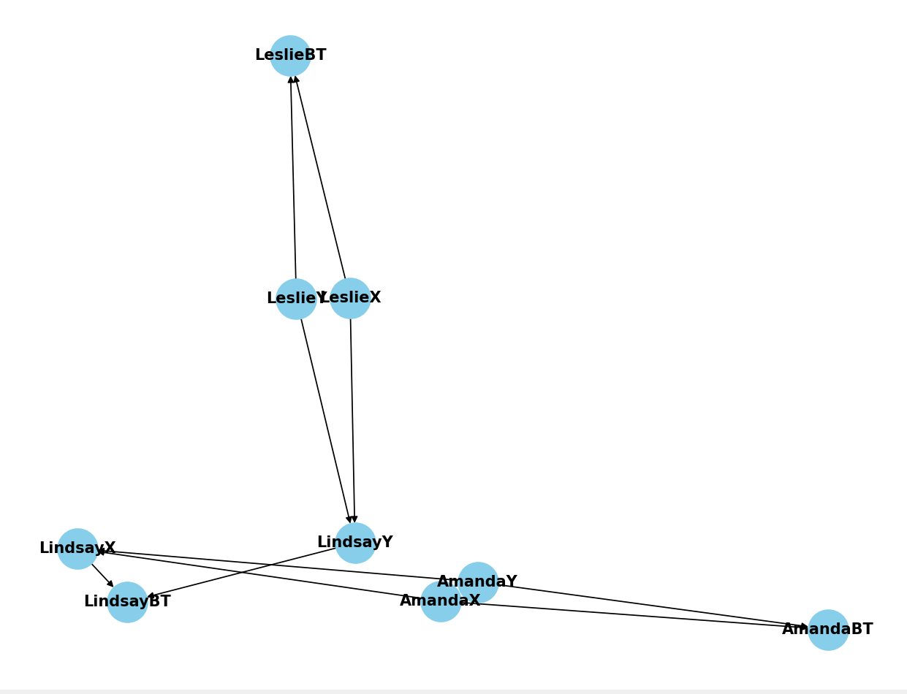

# Repository for AI Project 2.1

**Assignment:** [Compute Blood Types](https://kwarc.info/teaching/AISysProj/SS24/assignment-2.1.pdf)

### Libraries Used:

- pgmpy : a python library for working with Probabilistic Graphical Models. To install :
  $ pip install pgmpy
- networkx : a Python package for the creation, manipulation, and study of the structure, dynamics, and functions of
  complex networks. To install : $ pip install networkx
- matplotlib : a comprehensive library for creating static, animated, and interactive visualizations in Python.
  To install : $ pip install matplotlib

### How To Run:

In our project we should have 2 folders. One of them must have the problems we want to solve and the
other one for us to create solution json files into.

'path_to_json' variable holds the name of the folder for problems and 'path_to_solution' variable holds
the name of the folder for solutions. The files should be created beforehand and their names should be
assigned to those variables. When we run the script, solutions to every json problem in problems folder will
be created as a json file in the solution folder.

### How The Script Works:

The script takes every json file from the problems folder. It loops through all and calls the guess_blood
function for each. Every time it returns a result and then the script writes the results into a new json file
which will be stored in the solutions folder.

Inside the guess_blood function, first we create our network. We divided each person into two alleles X and Y.
So we have variables such as subX and subY for the subject and objX and objY for the object. We also created
a blood-type variable for both subject and object as subBT and objBT. While subBT is directly depended on subX and subY
alleles,
objBT is depended on objX and objY alleles. Also, object's X is depended on the mother's alleles while object's Y is
depended on the father's alleles. In case they don't have both parents, they get the allele probabilities of the country
allele probabilities for the missing parent. Then we added the state names and the values they can get. Since subX,
subY, objX,
objY are alleles, they can get A, B or 0 while subBT and objBT can get A, B, AB or 0. According to this logic, we added
the nodes and edges.

#### Example Network

Then we created the conditional probability distribution tables. If subject alleles do not have their CPDs in the
network already, we create them
by taking country values. CPDs for subBT and objBT are created as well by taking blood_type_chart values and X and Y
alleles as evidences.

#### country

These two conditional probability tables show the allele distribution of the given countries.

| Alleles | north_wumponia |
|:-------:|:--------------:|
|    A    |      0.40      |
|    B    |      0.35      |
|    O    |      0.25      |  

| Alelles | south_wumponia |
|:-------:|:--------------:|
|    A    |      0.25      |
|    B    |      0.45      |
|    O    |      0.30      |

#### subject_values

This table shows what can be the child's alleles depending on their parent's alleles.

| subX | subY |  A  |  B  |  O  |
|:----:|:----:|:---:|:---:|:---:|
|  A   |  A   |  1  |  0  |  0  |
|  A   |  B   | 0.5 | 0.5 |  0  |
|  A   |  O   | 0.5 |  0  | 0.5 |
|  B   |  A   | 0.5 | 0.5 |  0  |
|  B   |  B   |  0  |  1  |  0  |
|  B   |  O   |  0  | 0.5 | 0.5 |
|  O   |  A   | 0.5 |  0  | 0.5 |
|  O   |  B   |  0  | 0.5 | 0.5 |
|  O   |  O   |  0  |  0  |  1  |

#### blood_type_chart

This table shows the resulting blood type of a person, given their alleles.

| AlleleX | AlleleY | A | B | AB | O |
|---------|:-------:|:-:|:-:|:--:|:-:|
| A       |    A    | 1 | 0 | 0  | 0 |
| A       |    B    | 0 | 0 | 1  | 0 |
| A       |    O    | 1 | 0 | 0  | 0 |
| B       |    A    | 0 | 0 | 1  | 0 |
| B       |    B    | 0 | 1 | 0  | 0 |
| B       |    O    | 0 | 1 | 0  | 0 |
| O       |    A    | 1 | 0 | 0  | 0 |
| O       |    B    | 0 | 1 | 0  | 0 |
| O       |    O    | 0 | 0 | 0  | 1 |

If the relation is mother-of, CPD for object's X allele is created by using subject_values and subX and subY as
evidences. If the CPD for object's
Y allele does not exist, we create it by using country values and add every CPD into our network. But, if the CPD for
object's Y allele exists, we add
every CPD except the objY into our network. That way, we don't overwrite the CPD for objY.

If the relation is father-of, CPD for object's Y allele is created by using subject_values and subX and subY as
evidences. If the CPD for object's
X allele does not exist, we create it by using country values and add every CPD into our network. But, if the CPD for
object's X allele exists, we add
every CPD except the objY into our network. That way, we don't overwrite the CPD for objX.

The test results were added as evidence in the end. We have 3 types of test results which are blood-type test, mixed
blood-type test and pair blood-type test.

Blood-type test gives us the correct blood-type for the tested person. We simply add the tested person's name and the
result of the test to our evidences.

Mixed blood-type test mixes the blood of 2 people and gives us a combined blood-type as result. Because that the blood
types of two people that take the test directly effect the result of it, we create a new node for the test MBT and
connect the test takers' Blood Type (BT) nodes as parents. After that, we add the CPD for this node, called
mixed_blood_test.
And finally we add the test results as evidences.

#### mixed_blood_test

This CPD gives us the mixed blood test's results, depending on the blood types of person 1 and person 2 that takes the
test.

| Person 1 | Person 2 | A | B | AB | O |
|:--------:|:--------:|:-:|:-:|:--:|:-:|
|    A     |    A     | 1 | 0 | 0  | 0 |
|    A     |    B     | 0 | 0 | 1  | 0 |
|    A     |    AB    | 0 | 0 | 1  | 0 |
|    A     |    O     | 1 | 0 | 0  | 0 |
|    B     |    A     | 0 | 0 | 1  | 0 |
|    B     |    B     | 0 | 1 | 0  | 0 |
|    B     |    AB    | 0 | 0 | 1  | 0 |
|    B     |    O     | 0 | 1 | 0  | 0 |
|    AB    |    A     | 0 | 0 | 1  | 0 |
|    AB    |    B     | 0 | 0 | 1  | 0 |
|    AB    |    AB    | 0 | 0 | 1  | 0 |
|    AB    |    O     | 0 | 0 | 1  | 0 |
|    O     |    A     | 1 | 0 | 0  | 0 |
|    O     |    B     | 0 | 1 | 0  | 0 |
|    O     |    AB    | 0 | 0 | 1  | 0 |
|    O     |    0     | 0 | 0 | 0  | 1 |

Pair blood-type test takes blood samples of 2 people and tells the blood-type of each person individually. However,
there's 20% chance they mix up the samples.
For that reason, tested people's blood-types influences both of the results. So we added edges to both of them for each
person's blood-type. We also added a new node
called PBT for the pair blood-type test and added edges to both results from it. After that we created the CPD for PBT
by using pair_blood_test_check as values and a new
PBT state which takes work or fail as values. Then CPDs for both results are created. Result1's CPD uses
pair_blood_test_1 and Result2's CPD uses pair_blood_test_2. Finally, we add
both of the CPDs for results into evidences.

#### subject_values

This table shows what can be the child's alleles depending on their parent's alleles.

| subX | subY |  A  |  B  |  O  |
|:----:|:----:|:---:|:---:|:---:|
|  A   |  A   |  1  |  0  |  0  |
|  A   |  B   | 0.5 | 0.5 |  0  |
|  A   |  O   | 0.5 |  0  | 0.5 |
|  B   |  A   | 0.5 | 0.5 |  0  |
|  B   |  B   |  0  |  1  |  0  |
|  B   |  O   |  0  | 0.5 | 0.5 |
|  O   |  A   | 0.5 |  0  | 0.5 |
|  O   |  B   |  0  | 0.5 | 0.5 |
|  O   |  O   |  0  |  0  |  1  |

#### blood_type_chart

This table shows the resulting blood type of a person, given their alleles.

| AlleleX | AlleleY | A | B | AB | O |
|---------|:-------:|:-:|:-:|:--:|:-:|
| A       |    A    | 1 | 0 | 0  | 0 |
| A       |    B    | 0 | 0 | 1  | 0 |
| A       |    O    | 1 | 0 | 0  | 0 |
| B       |    A    | 0 | 0 | 1  | 0 |
| B       |    B    | 0 | 1 | 0  | 0 |
| B       |    O    | 0 | 1 | 0  | 0 |
| O       |    A    | 1 | 0 | 0  | 0 |
| O       |    B    | 0 | 1 | 0  | 0 |
| O       |    O    | 0 | 0 | 0  | 1 |

#### mixed_blood_test

This CPD gives us the mixed blood test's results, depending on the blood types of person 1 and person 2 that takes the
test.

| Person 1 | Person 2 | A | B | AB | O |
|:--------:|:--------:|:-:|:-:|:--:|:-:|
|    A     |    A     | 1 | 0 | 0  | 0 |
|    A     |    B     | 0 | 0 | 1  | 0 |
|    A     |    AB    | 0 | 0 | 1  | 0 |
|    A     |    O     | 1 | 0 | 0  | 0 |
|    B     |    A     | 0 | 0 | 1  | 0 |
|    B     |    B     | 0 | 1 | 0  | 0 |
|    B     |    AB    | 0 | 0 | 1  | 0 |
|    B     |    O     | 0 | 1 | 0  | 0 |
|    AB    |    A     | 0 | 0 | 1  | 0 |
|    AB    |    B     | 0 | 0 | 1  | 0 |
|    AB    |    AB    | 0 | 0 | 1  | 0 |
|    AB    |    O     | 0 | 0 | 1  | 0 |
|    O     |    A     | 1 | 0 | 0  | 0 |
|    O     |    B     | 0 | 1 | 0  | 0 |
|    O     |    AB    | 0 | 0 | 1  | 0 |
|    O     |    0     | 0 | 0 | 0  | 1 |
      

